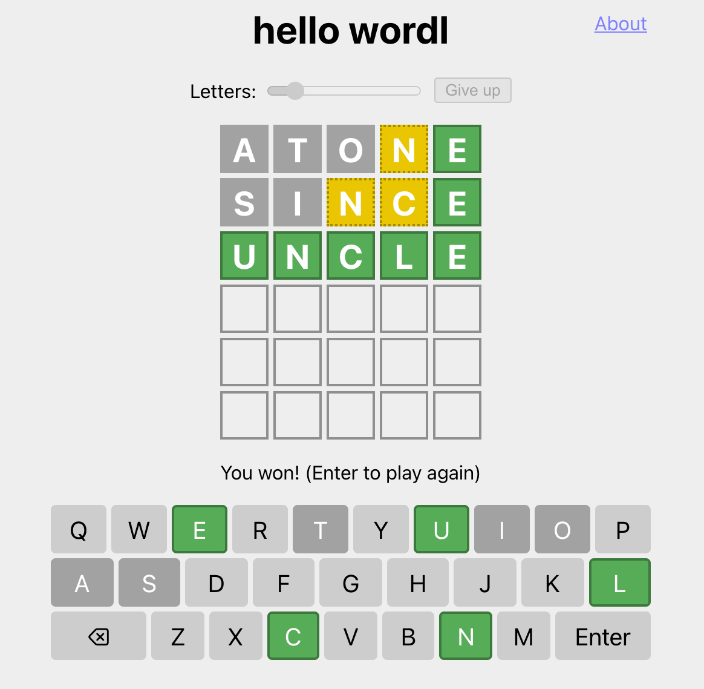

# wordle-solver

A simply ruby program to solve https://www.powerlanguage.co.uk/wordle/

## Usage

The program can be run from the command line with `./wordle.rb`.

You will be prompted to enter what word you guessed, followed by a string of characters denoting how correct each letter of the guess was: `n` for a grey letter, `y` for a green letter and `m` for a yellow letter (short for "no", "yes" and "maybe" respectively).

The program will then print a list of all English words could possibly be the solution, followed by its 5 best guesses for what the word could be based on the frequency of letters in the English alphabet<sup>1</sup>. The program will then continually prompt for another guess and correctness, refining its guesses until you hit `Ctrl+C` to exit the program.

For example, using http://foldr.moe/hello-wordl/ where the word was `uncle`:

```
aopal@MacBook-Pro wordle-solver % ruby wordle.rb
Input guess and correctness
atone
nnnmy
candidates: ["rinse", "snide", "rinde", "insue", "since", "inure", "niche", "singe", "snipe", "ringe", "nigre", "hinge", "nurse", "nudie", "indue", "unlie", "incle", "dinge", "gnide", "nidge", "insee", "nisse", "nifle", "ernie", "ingle", "linge", "unice", "mince", "hynde", "yince", "wince", "inkle", "minge", "linje", "linie", "pinge", "vince", "inbye", "binge", "dense", "knife", "lense", "niece", "minie", "dunce", "uncle", "winze", "ineye", "genie", "undye", "nudge", "unuse", "ensue", "unsee", "knive", "cense", "sence", "enure", "mense", "lunge", "hence", "fnese", "nieve", "venie", "pense", "zinke", "genre", "inkie", "henge", "cunye", "munge", "nixie", "punce", "funge", "undue", "undee", "endue", "nerve", "bunce", "mende", "wende", "neese", "sense", "engle", "nunce", "neume", "funje", "fence", "uneye", "gunge", "pence", "ngwee", "venue", "neele", "venge", "nuque", "mneme", "neeze"]
best guesses: ["rinse", "snide", "rinde", "insue", "since"]
Input guess and correctness
since
nnmmy
candidates: ["uncle"]
best guesses: ["uncle"]
```



## Credits

- List of English words taken from https://github.com/dwyl/english-words
- Letter frequencies taken from http://pi.math.cornell.edu/~mec/2003-2004/cryptography/subs/frequencies.html

## Footnotes
<sup>1</sup> This is not entirely correct, as the program will favor guesses that use unique letters over ones that repeat common letters from the English alphabet. This is done because guesses that use unique letters will eliminate or validate which letters are in the word faster, hopefully resulting in a correct guess in fewer attempts.
